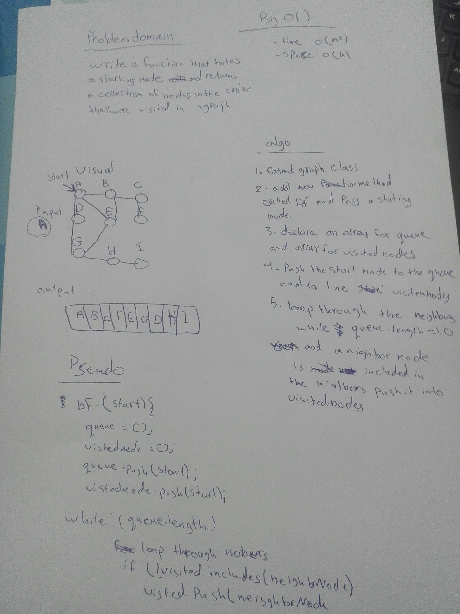

# breadth-first traversal
Implement a breadth-first traversal on a graph.

## Challenge
Write breadth-first traversal method that accepts a starting node. Without utilizing any of the built-in methods available to your language, return a collection of nodes in the order they were visited. Display the collection.

## Approach & Efficiency
- Time Complexity: O(n^2)
- space O(n)

## Solution
