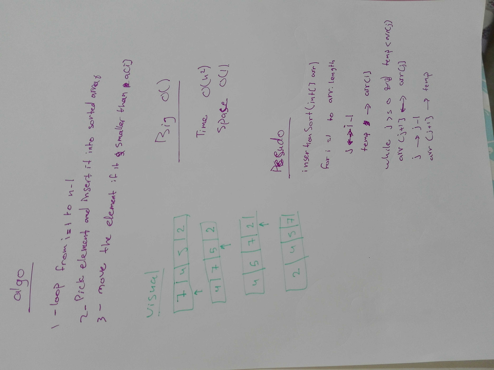

# Insertion sort
Implement insertion sort algorithm

## Challenge

- Provide a visual step through for each of the sample arrays based on the provided pseudo code
- Convert the pseudo-code into working code
- Present a complete set of working tests

## Approach & Efficiency
- Time Complexity: O(n^2)
- Space Complexity: O(1)

## Solution
-  tree

