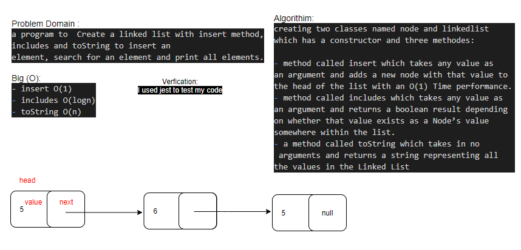
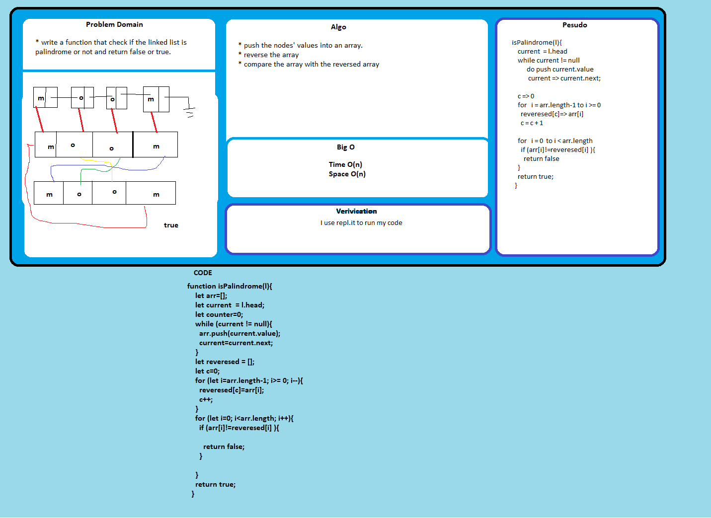
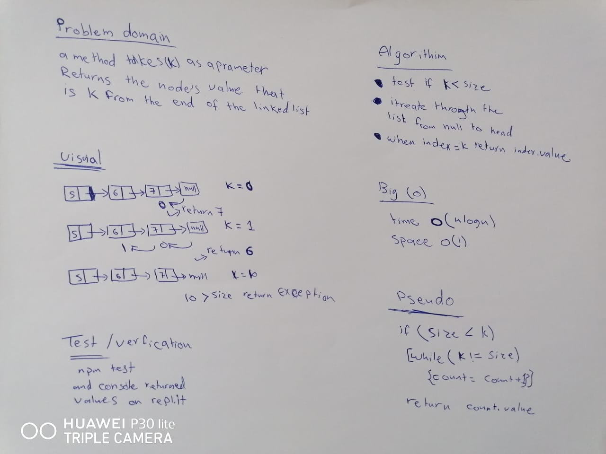
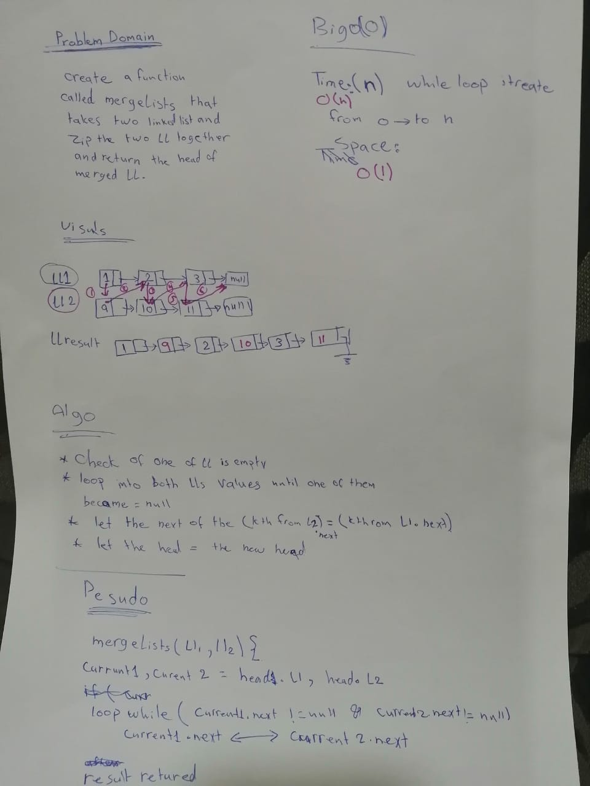

# data-structures-and-algorithm

# Linked List
a program to  Create a linked list with insert method, includes and toString to insert an element, search for an element, print all elements, append an element, insertBefore a specific element and after a specific one, a method called kthFromEnd(k) for the Linked List class which takes a number. Return the node’s value that is k from the end of the linked list and a  method called mergeLists which takes two linked lists as arguments.
## Challenge
creating two classes named node and linkedlist which has a constructor and these methodes:

- method called insert which takes any value as an argument and adds a new node with that value to the head of the list with an O(1) Time performance.
- method called includes which takes any value as an argument and returns a boolean result depending on whether that value exists as a Node’s value somewhere within the list.
- a method called toString which takes in no arguments and returns a string representing all the values in the Linked List.
- a method called append(value) which adds a new node with the given value to the end of the list
- a method called insertBefore(value, newVal) which add a new node with the given newValue immediately before the first value node
- a method called insertAfter(value, newVal) which add a new node with the given newValue immediately after the first value node
- a method called kthFromEnd(k) for the Linked List class which takes a number, k, as a parameter. Return the node’s value that is k from the end of the linked list.
- a method called mergeLists which takes two linked lists as arguments. Zip the two linked lists together into one so that the nodes alternate between the two lists and return a reference to the head of the zipped list. 

## Approach & Efficiency
- insert O(1)
- includes O(nlogn)
- toString O(nlogn)
- append O(n)
- insertAfter O(nlogn)
- insertBefore O(nlogn)
- kthFromEnd O(nlogn)

- mergedLists
    - time O(n)  while loop from 1 to n
    - space O(1) no extra space

## Solution
- linked list

- linked list insertion

- k-th value

- mergedLists

