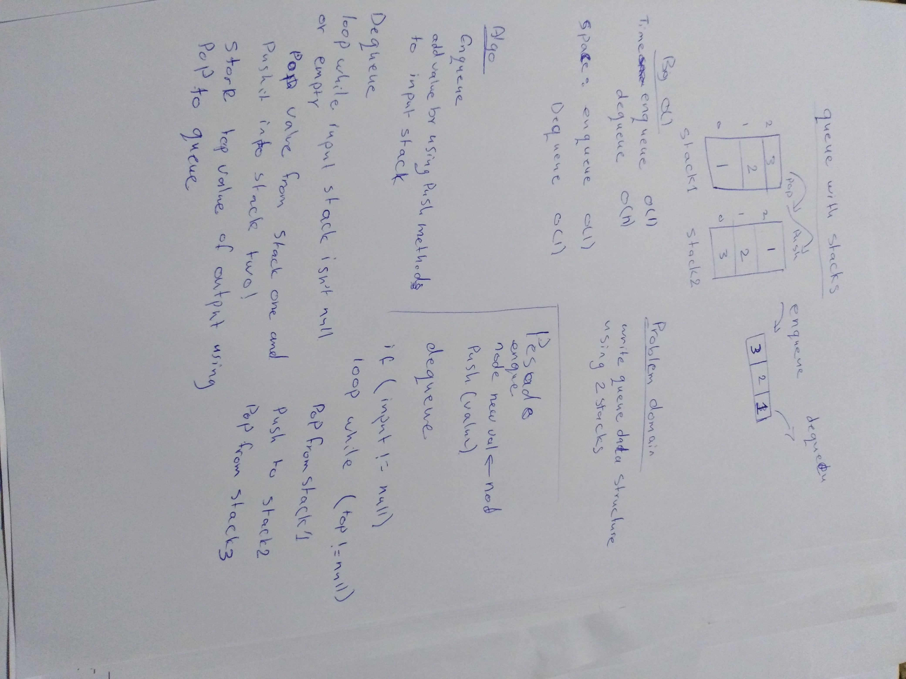

# data-structures-and-algorithm

# Queue with stack
a program to  Create a brand new PseudoQueue class to create queue with stack. methods : enqueue , dequeue
## Challenge
Stack instances have only push, pop, and peek methods. Instantiate these Stack objects in your PseudoQueue constructor.

- queue
    - enqueue()
    - dequeue()
   
## Approach & Efficiency
- enqueue() = time O(1)   space O(1)
- dequeue()  = time O(n)  space O(1)

## Solution
- Queue with Stacks

