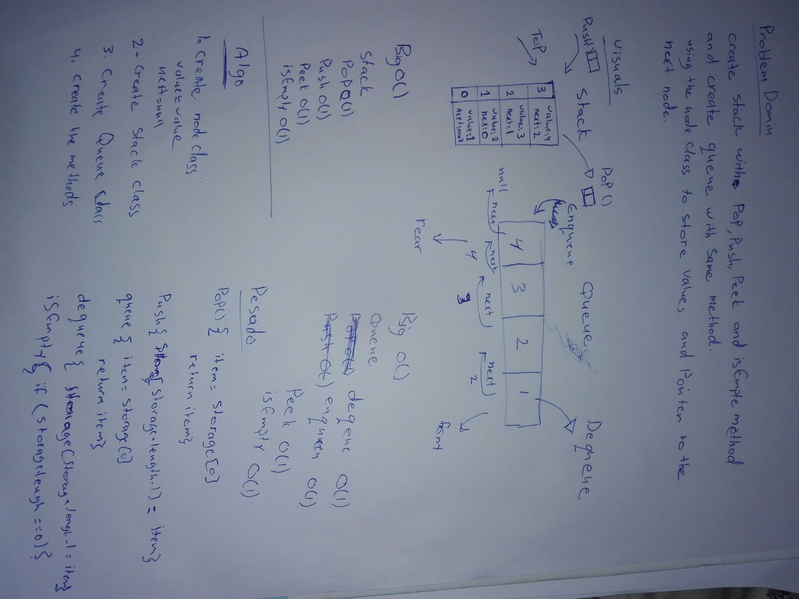

# data-structures-and-algorithm

# Stacks and Queues
a program to  Create a Stack and Queue with push or enqueue, pop or dequeue, peek and isEmpty.
## Challenge
creating three classes named node, Stack and Queue which have a constructor and these methodes:
- stack 
    - pop()
    - push()
    - peek()
    - isEmpty
- queue
    - enqueue()
    - dequeue()
    - peek()
    - isEmpty

## Approach & Efficiency
- stack 
    - pop() = O(1)
    - push() = O(1)
    - peek() = O(1)
    - isEmpty= O(1)
- queue
    - enqueue() = O(1)
    - dequeue()  = O(1)
    - peek() = O(1)
    - isEmpty = O(1)

## Solution
- Stack and Queue

