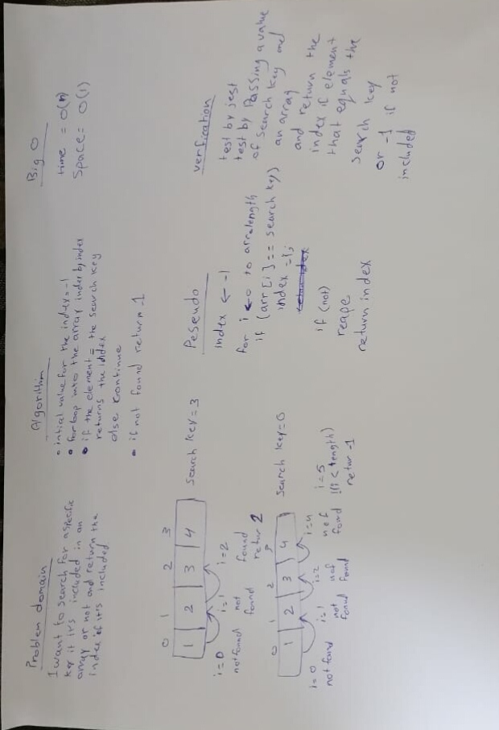

# data-structures-and-algorithm

# BinarySearch
a program to search for an element in a sorted array by search key.

## Challenge
For the binary search  I loop into the array element by element to find if there is an element equales the search key.

## Approach & Efficiency
I used for loop to represents each element at its respective and index but I didn't use extra space, which is O(1) space complexity. 

## Solution

