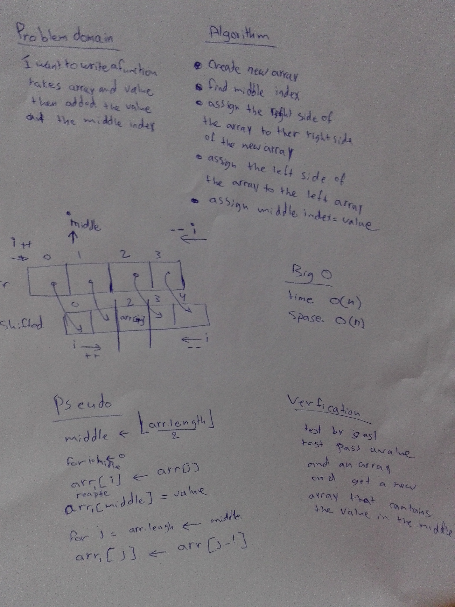

# data-structures-and-algorithm

# Reverse an Array
a program to  shift array, takes an array as and a value arguments and return an array with the new value added at the middle index.

## Challenge
For the shift an array I produced a new array an empty array to fill up later by 2 for loops.

## Approach & Efficiency
I used for loop to represents each element at its respective and index, which is O(n) space complexity. 

## Solution

