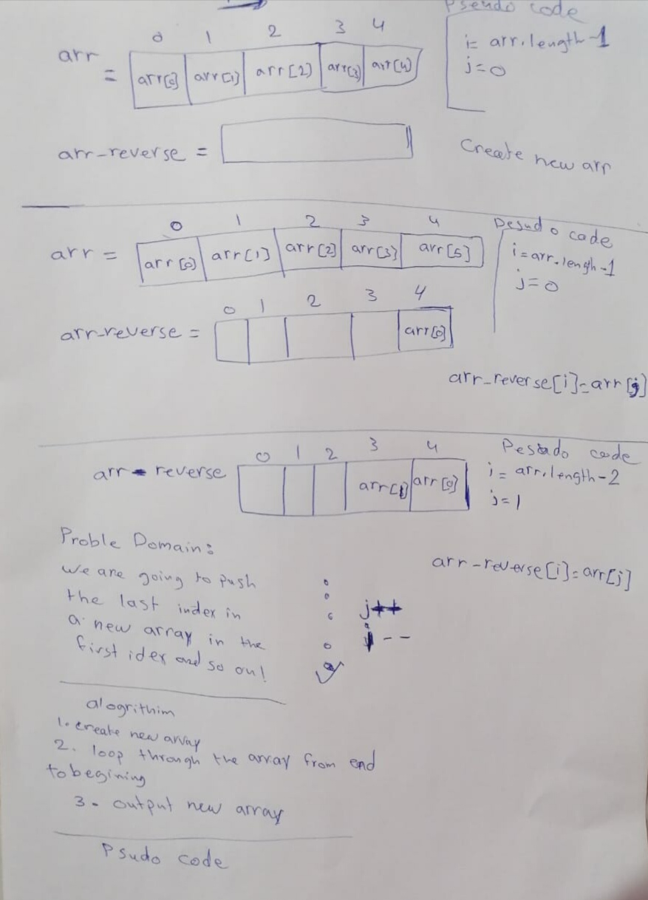

# data-structures-and-algorithm

# Reverse an Array
a program to  reverse array, takes an array as an argument and produces a new array that has the same elements in the inverse order.

## Challenge
For the reverse an array I produced a new array an empty array to fill up later by for loop.

## Approach & Efficiency
I used for loop to represents each element at its respective and index, which is O(n) space complexity. 

## Solution

## Table of contents

Challenge           | Link
------------------- |--------
Reverse an array    | [challeng1](https://github.com/batool-alali-401-advanced-javascript/data-structures-and-algorithms/blob/master/JavaScript/challenges/array-reverse.js)

